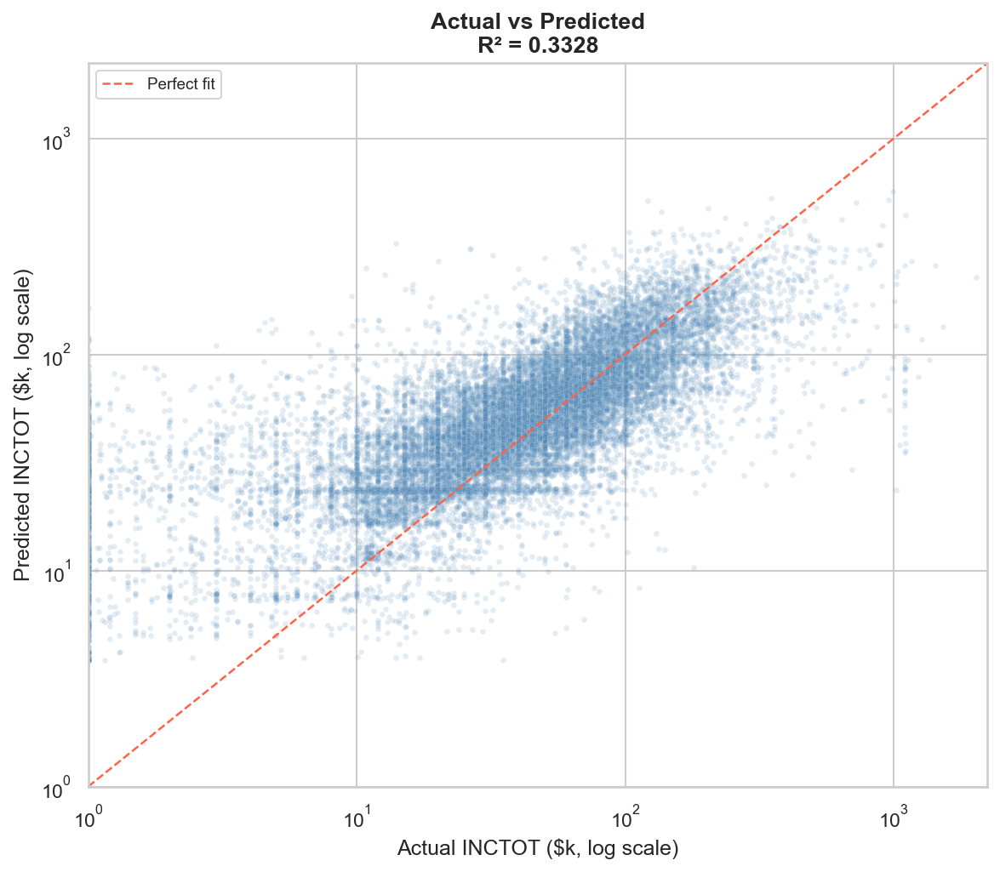
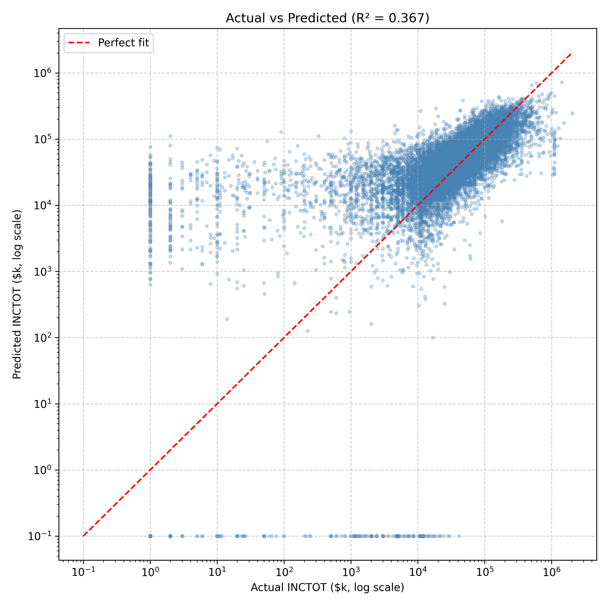
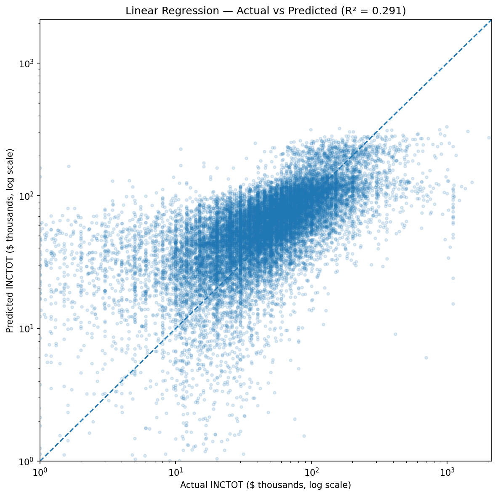
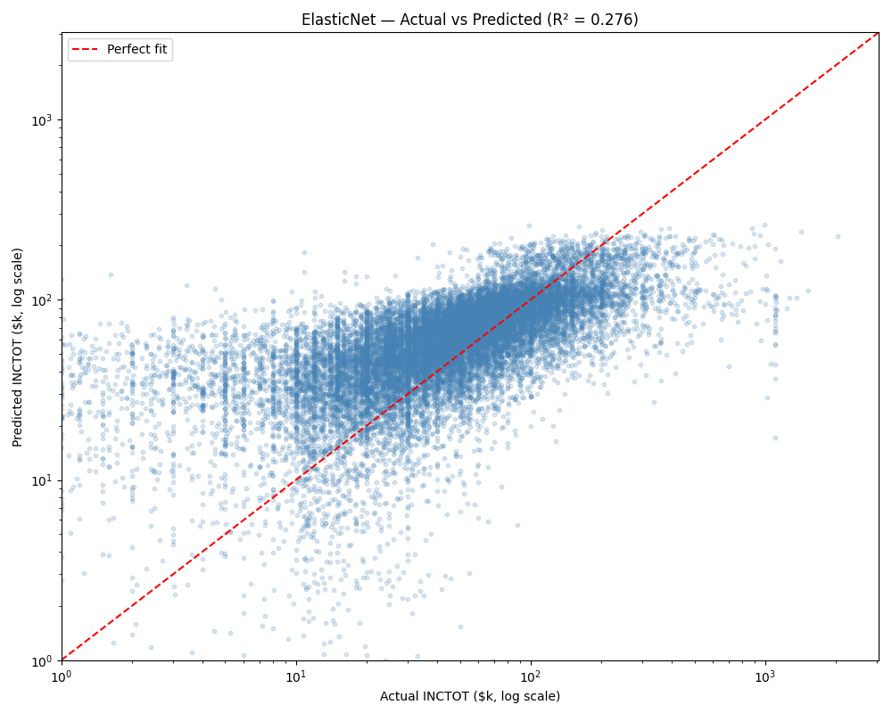
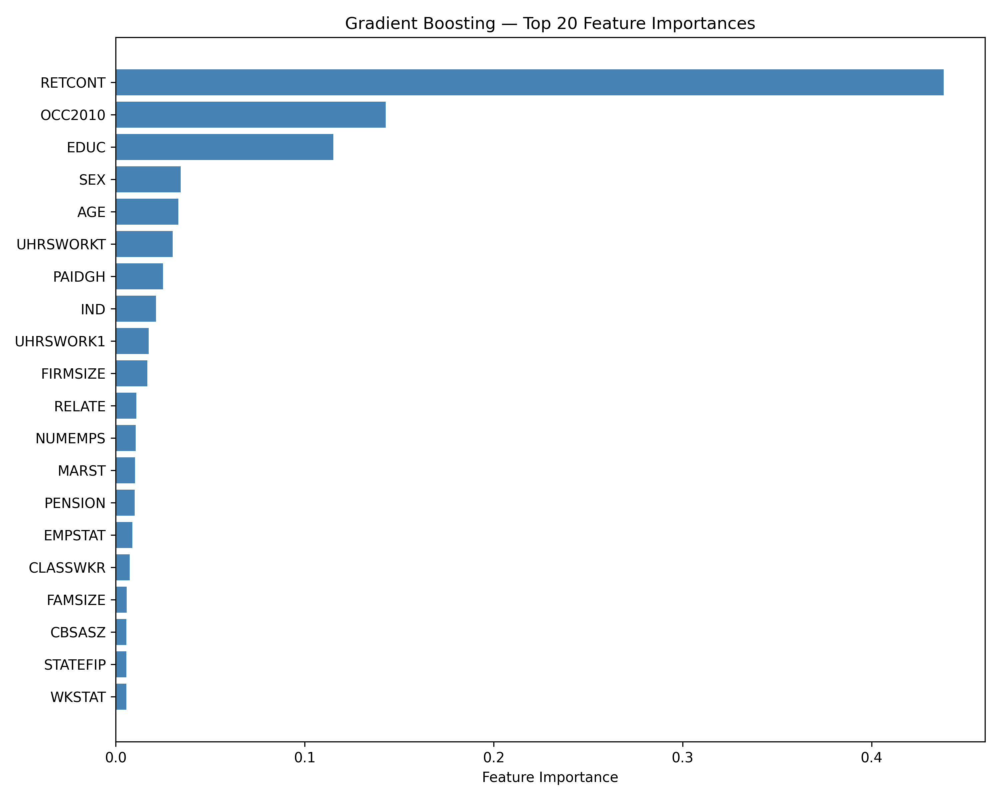

# Predicting Personal Income Using Machine Learning Models

## 1. Project Overview

This project uses **IPUMS Current Population Survey (CPS)** to predict total personal income and to identify the key socioeconomic factors associated with personal income variation.

To address this problem, we build a machine learning pipeline that includes data cleaning, feature engineering, model training, and model evaluation. Models —(1) Random Forest, (2) Gradient Boosting, (3) Linear Regression, and (4) Elastic Net—to compare their predictive performance on socioeconomic data. 

#### Research Questions
- What is the feature that is most relevant to predicting one's income?
- Which machine learning model is more accurate in predicting one's income with the relative features?

---

## 2. Dataset Description

### 2.1. Data Source

IPUMS CPS (https://cps.ipums.org/cps/) provides U.S. Census Bureau's Current Population Survey — a monthly survey of approximately 150,000 households that serves as the primary source for U.S. labor force statistics.

- **Extract ID**: `cps_00001`
- **File format**: Fixed-width ASCII (`.dat`), parsed via DDI XML codebook (`.xml`)
- **Total number of respondents**: 144,265
- **Selected number of respondents (w/o NaN)**: 102,330
- **Total variables in extract**: 313
- **Selected variables for analysis**: 47 features + 1 target

---

### 2.2 Variables

#### Target Variable ($y$)

| Variable | Description | Range |
|----------|-------------|-------|
| `INCTOT` | Total personal income | Filtered to $1 \leq y \leq 9{,}999{,}998$ to exclude NIU and top-coded values |

#### Feature Variables ($X$)

47 features were selected from the 313-variable extract, grouped into 8 categories.

### 1. Demographics

| Variable | Description | Example Codes |
|---------|-------------|----------------|
| **AGE** | Age in years | 25 → 25 years old |
| **SEX** | Gender | 1 = Male, 2 = Female |
| **RACE** | Race category | 100 = White, 200 = Black, 651 = Asian |
| **MARST** | Marital status | 1 = Married (spouse present), 4 = Divorced, 6 = Never married |
| **VETSTAT** | Veteran status | 1 = No service, 2 = Veteran |
| **RELATE** | Relationship to household head | 101 = Head, 201 = Spouse, 301 = Child |
| **POPSTAT** | Population status | 1 = Adult civilian, 2 = Armed forces, 3 = Child |
| **HISPAN** | Hispanic origin | 0 = Not Hispanic, 100 = Mexican, 200 = Puerto Rican |
| **NATIVITY** | Native/foreign-born | 1 = Native, 4/5 = Foreign-born |
| **CITIZEN** | Citizenship | 1 = Born in U.S., 4 = Naturalized, 5 = Not a citizen |
| **BPL** | Birthplace | 09900 = U.S., 50220 = Korea |

### 2. Education

| Variable | Description | Example Codes |
|---------|-------------|----------------|
| **EDUC** | Educational attainment | 073 = High school diploma, 111 = BA, 123 = MA |
| **SCHLCOLL** | School/college attendance | 1 = HS full-time, 3 = College full-time, 5 = Not in school |

### 3. Family

| Variable | Description | Example Codes |
|---------|-------------|----------------|
| **FAMSIZE** | Family size | 1, 2, 3… |
| **FAMKIND** | Family type | 1 = Husband-wife, 2 = Male head, 3 = Female head |

### 4. Geography

| Variable | Description | Example Codes |
|---------|-------------|----------------|
| **REGION** | Census region | 11 = Northeast, 21 = Midwest, 31 = South, 41 = West |
| **STATEFIP** | State FIPS | 06 = CA, 36 = NY, 48 = TX |
| **METRO** | Metropolitan status | 1 = Non-metro, 2 = Central city, 3 = Outside central city |
| **CBSASZ** | Metro area size | 0 = NIU, 6 = 5M+ |

### 5. Employment

| Variable | Description | Example Codes |
|---------|-------------|----------------|
| **EMPSTAT** | Employment status | 10 = At work, 21 = Unemployed, 32 = Retired |
| **LABFORCE** | Labor force status | 1 = No, 2 = Yes |
| **CLASSWKR** | Class of worker | 10 = Self-employed, 21 = Private, 25 = Federal |
| **OCC2010** | Occupation code | 0010 = CEO |
| **IND** | Industry code | 0170 = Agriculture |
| **UHRSWORKT** | Usual weekly hours (all jobs) | Actual hours |
| **UHRSWORK1** | Usual weekly hours (main job) | Actual hours |
| **WKSTAT** | Work status | 11 = Full-time, 21 = PT involuntary, 22 = PT voluntary |
| **NUMEMPS** | Number of employers | 1, 2, 3… |
| **FIRMSIZE** | Firm size | 1 = <25, 5 = 100–499, 9 = 1000+ |
| **PENSION** | Pension coverage | 1 = No, 2 = Yes |
| **PAIDHOUR** | Paid hourly | 1 = No, 2 = Yes |
| **UNION** | Union membership | 1 = No union, 2 = Member, 3 = Covered |
| **SRCEARN** | Source of earnings | 1 = Wage/salary, 2 = Self-employed |
| **RETCONT** | Retirement contributions | 1 = No, 2 = Yes |
| **PAIDGH** | Employer-paid group health | 1 = No, 21 = All, 22 = Part |

### 6. Housing

| Variable | Description | Example Codes |
|---------|-------------|----------------|
| **OWNERSHP** | Home ownership | 10 = Owned, 20 = Rented |
| **UNITSSTR** | Units in structure | 01 = Mobile home, 03 = Single family, 10 = 5–9 units |
| **PUBHOUS** | Public housing | 1 = No, 2 = Yes |
| **RENTSUB** | Rent subsidy | 1 = No, 2 = Yes |

### 7. Government Benefits

| Variable | Description | Example Codes |
|---------|-------------|----------------|
| **FOODSTMP** | SNAP recipiency | 1 = No, 2 = Yes |
| **HEATSUB** | Energy subsidy | 1 = No, 2 = Yes |

### 8. Health Insurance

| Variable | Description | Example Codes |
|---------|-------------|----------------|
| **ANYCOVLY** | Any coverage last year | 1 = No, 2 = Yes |
| **PHINSUR** | Private insurance | 1 = No, 2 = Yes |
| **GRPCOVLY** | Group insurance | 1 = No, 2 = Yes |
| **HIMCAIDLY** | Medicaid | 1 = No, 2 = Yes |
| **HIMCARELY** | Medicare | 1 = No, 2 = Yes |
| **PAIDGH** | Employer-paid group health | 1 = No, 21 = All, 22 = Part |

### 9. Migration

| Variable | Description | Example Codes |
|---------|-------------|----------------|
| **MIGRATE1** | Migration status (1 year) | 1 = Same house, 3 = Different county, 5 = Different state |

> **Note**: IPUMS "Not in Universe" (NIU) values (e.g., 99, 999, 9999, ...) are replaced with `NaN` during preprocessing and imputed using median imputation via `sklearn.impute.SimpleImputer`.

---

### 2.3. Train / Test Split

The dataset is split into training and test sets using `sklearn.model_selection.train_test_split`:

| Parameter | Value |
|-----------|-------|
| Split ratio | 80% train / 20% test |
| `random_state` | 42 |

The split is performed **after** cleaning (NIU replacement and median imputation), and the resulting four files are saved to `data/processed/`:

```
data/processed/
├── X_train.csv
├── X_test.csv
├── y_train.csv
└── y_test.csv
```

### 2.4. Data Limitations

- **Self‑reported income** is subject to measurement error, which may introduce noise into the target variable.

- **Top‑coded high incomes** limit the model’s ability to learn extreme values and reduce variation in the upper tail.

- **Occupation and industry codes** are high‑dimensional and do not capture within‑category heterogeneity (e.g., experience, job role, firm type).

---

## 3. Modeling Approach and Individual Model Results

### 3.1. Random Forest

Each tree independently learns a set of splitting rules from a random subset of the training data and a random subset of features. The final prediction is the **average across all N trees**, which reduces variance and prevents overfitting compared to a single tree.

#### Decision Tree — Simplified Example

At each node, the tree asks a yes/no question about one feature and routes each observation left or right. The predicted income at each leaf is the average `INCTOT` of all training observations that ended up in that node.

```
                        ┌─────────────────────────┐
                        │   RETCONT < threshold?   │ 
                        └────────────┬────────────┘
                                     │
              ┌──────────────────────┴──────────────────────┐
             Yes                                            No
              │                                              │
   ┌──────────────────┐                        ┌────────────────────────┐
   │  OCC2010 < 500?  │                        │       AGE < 45?        │
   └────────┬─────────┘                        └──────────┬─────────────┘
            │                                             │
     ┌──────┴──────┐                              ┌───────┴───────┐
    Yes            No                            Yes              No
     │              │                             │                │
┌─────────┐   ┌──────────┐                 ┌──────────┐    ┌──────────────┐
│  EDUC   │   │  EDUC    │                 │Predicted │    │  Predicted   │
│ < 111?  │   │ >= 111?  │                 │ ~$62,000 │    │  ~$105,000   │
└────┬────┘   └────┬─────┘                 └──────────┘    └──────────────┘
     │              │
┌────┴────┐   ┌─────┴────┐
│Predicted│   │Predicted │
│ ~$28,000│   │ ~$75,000 │
└─────────┘   └──────────┘
```

This single tree is repeated N times, each time trained on a different random bootstrap sample of the data and a random subset of features. The final `INCTOT` prediction for any individual is the mean of all trees' predictions:

$$\hat{y} = \frac{1}{B} \sum_{b=1}^{B} T_b(\mathbf{x}), \quad B = N$$  
where:  
- $\hat{y}$ — predicted `INCTOT` for a given individual
- $B$ — total number of trees in the forest (= 300 after tuning)
- $T_b(\mathbf{x})$ — prediction from the $b$-th decision tree
- $\mathbf{x}$ — input feature vector (47 variables for one individual)

#### Search Space

| Parameter | Candidates | Description |
|-----------|------------|-------------|
| `n_estimators` | 100, 200, 300 | Number of decision trees in the ensemble |
| `max_depth` | 10, 15, 20 | Maximum depth of each tree |

#### Tuning Results (w/ GridSearchCV cross validation)

| Metric | Value |
|--------|-------|
| Best `n_estimators` | 300 |
| Best `max_depth` | 10 |
| Best CV $R^2$ (mean of 5 folds) | 0.3471 |
| Test $R^2$ (held-out 20%) | 0.3328 |

---

> **Note — Numerical vs. Categorical Variables**
>
> Random Forest treats all input variables as numeric and makes splits using a single threshold: *"Is feature X less than value t?"* This works naturally for **numerical variables** like `AGE` or `UHRSWORK1`, where larger values carry inherent order and magnitude.
>
> For **categorical variables** encoded as integers — such as `OCC2010` (occupation codes), `IND` (industry codes), or `REGION` — the model still applies threshold splits (e.g., `OCC2010 < 3000`). This can imply an ordering between categories that does not exist in reality. Since the primary goal of this project is to identify *which variables* matter (not *which categories* within a variable), this would suffice. 

---

### 3.2. Gradient Boosting

**Model Concept**

Gradient Boosting builds an ensemble of shallow decision trees sequentially, where each new tree is trained to correct the residual errors of the previous ones. This iterative structure allows the model to capture nonlinear relationships and complex interactions. Unlike Random Forest—which averages many independent trees—Gradient Boosting improves stage‑by‑stage and is more sensitive to hyperparameter choices.

$$
\hat{y}(x) = F_M(x) = F_0(x) + \sum_{m=1}^{M} \nu \cdot h_m(x)
$$

Where:

- $F_0(x)$: initial prediction (typically the mean of the target variable)
- $h_m(x)$: the weak learner (shallow tree) fitted at stage $m$
- $\nu$: learning rate controlling the contribution of each tree
- $M$: number of boosting stages (equivalent to `n_estimators`)

**Model Configuration**

| Hyperparameter | Description                                            |
|----------------| -------------------------------------------------------|
| n_estimators   | Number of boosting stages; controls how many sequential correction steps the model performs.                       |
| learning_rate  | Scales each tree’s contribution to the final prediction, preventing the model from overreacting to residual errors.|
| max_depth      | Maximum depth of each individual tree; keeps trees as weak learners and reduces early overfitting.                 |

**Hyperparameter Tuning (GridSearchCV)**

We first performed hyperparameter tuning using `GridSearchCV` with 3‑fold cross‑validation on the training set (81,864 observations and 47 features).

Because income is highly skewed, model performance metrics (R², MSE, MAE) were computed on the **original income scale**, while a **log10(1 + x)** transformation was applied **only for visualization** to both actual and predicted values.


*Search Space*

| Hyperparameter | Value Tested              |
|----------------|---------------------------|
| n_estimators   | 100, 200, 300, 400, 500   | 
| learning_rate  | 0.01, 0.03, 0.05, 0.1     |
| max_depth      | 2, 3, 4                   |

**Hyperparameter Tuning (Optuna)**

We then applied `Optuna` to perform a more flexible, continuous search over the hyperparameter space. Unlike `GridSearchCV`, which evaluates a fixed grid, `Optuna` explores the space adaptively and focuses on promising regions. As with the grid search, each trial was evaluated using 3‑fold cross‑validation on the training set, and model performance metrics (R², MSE, MAE) were computed on the **original income scale**. 

For visualization consistency across tuning methods, we applied the same **log10(1 + x)** transformation **only when plotting actual and predicted income values**, which stabilizes the scale, reduces the influence of extreme outliers, and produces clearer, more interpretable plots.

*Search Space*

| Hyperparameter | Value Tested         |
|----------------|----------------------|
| n_estimators   | 100–500              | 
| learning_rate  | 0.01–0.05 (log scale)|
| max_depth      | 2–4                  |

---

**Comparison within Gradient Boosting**

|Parameter/Metric    |Baseline GB|Grid GB  |Optuna GB|
|--------------------|-----------|---------|---------|
|n_estimators        |300        |200      |475      |
|learning_rate       |0.05       |0.1      |0.0382   |
|max_depth           |3          |4        |4        |
|Test MSE            |4.80B      |4.72B    |4.73B    |
|Test MAE            |30,158     |29,766   |29,747   |
|Test R²             |0.3559     |0.3666   |0.3659   |
|n_trials (effective)|-          |60       |20       |    
|Computation Time    |-          |~10 min  |~14 min  |

**Note.** Both GridSearchCV and Optuna used 3‑fold cross‑validation. GridSearchCV evaluated all 60 hyperparameter combinations (5 × 4 × 3), resulting in 180 total model fits. Optuna performed 20 adaptive trials (60 total fits). Thus, the effective number of trials is 60 for GridSearchCV and 20 for Optuna.

Both tuned models (Grid GB and Optuna GB) achieve lower prediction error and higher explanatory power than the baseline model, demonstrating that hyperparameter optimization meaningfully improves Gradient Boosting performance.

When comparing Grid GB and Optuna GB, neither model clearly dominates the other. Their performance differences are small, and the results depend heavily on the chosen hyperparameter search space. Expanding or narrowing the search ranges would likely shift the optimal configuration and the resulting metrics. Ultimately, there is a trade‑off between achieving the best possible performance and minimizing computation time.

**Top 5 Feature Importance within Gradient Boosting**

All Gradient Boosting models identify **RETCONT**, **OCC2010**, **EDUC**, and **SEX** as dominant predictors.

The tuned models (Grid GB and Optuna GB) include **AGE** in the top 5 instead of **UHRSWORKT**. 

---

**Comparison with Random Forest**

| Metric | Random Forest  | **Gradient Boosting**  |Description  |
|--------|----------------|------------------------|-------------|
| MSE    | 4.97B          | 4.73B                  |lower error  |
| MAE    | 31,029         | 29,747                 |lower error  |
| R²     | 0.3328         | 0.3651                 |higher R²    |

Gradient Boosting (Optuna) achieves lower MSE and MAE and a higher R² than Random Forest, indicating smaller prediction errors and stronger explanatory power.

For simplicity and clarity, only the Optuna‑based training code and final results are included in the repository, while the baseline model and the GridSearchCV setup are documented here as part of the model development process.

---

**Reduced Feature Analysis**

To evaluate whether a smaller and more interpretable feature set can achieve comparable performance, we constructed a reduced Gradient Boosting model using the 20 features that consistently appeared among the top predictors across Elastic Net, Random Forest, and Gradient Boosting. These variables represent the most stable and influential determinants of income in our dataset and allow us to test the robustness of the Gradient Boosting results while simplifying the feature space.

*Selected Top 20 Features with brief description*

`RETCONT` retirement contributions, `OCC2010` occupation code, `EDUC` education level, `SEX` sex, `AGE` age, `PAIDGH` employer-paid group health, `FIRMSIZE` firm size, `RELATE` relationship to household head, `CBSASZ` metro area size, `MARST` marital status, `UHRSWORKT` usual weekly hours, all jobs, `UHRSWORK1` usual weekly hours, main job, `IND` industry, `FAMSIZE` family size, `PENSION` pension coverage, `EMPSTAT` employment status, `WKSTAT` work status, `HIMCAIDLY` Medicaid coverage, `NUMEMPS` number of employers, 
`CLASSWKR` class of worker.

**Performance Comparison: Full vs. Reduced Gradient Boosting**

| Metrics         | Full GB       | **Reduced GB**   | Description           | 
|-----------------|---------------|------------------|-----------------------|
|                 | (47 features) |**(20 features)** |                       |
| MSE             | 4.73B         | 4,76B            | slightly higher error |
| MAE             | 29,747        | 29,989           | slightly higher error |
| R²              | 0.3651        | 0.3611           | slightly lower R²     |
|Computation Time |~14 min        |~5 min            | much shorter          |

Using only the top 20 consensus features, the reduced Gradient Boosting model performs very similarly to the full 47‑feature specification, though it exhibits slightly higher MSE and MAE and a small decrease in R². These modest differences indicate that while the reduced model sacrifices a small amount of predictive accuracy, a large share of the predictive signal is still concentrated in a relatively small subset of variables. This suggests that the selected features capture the core determinants of income while offering a more compact and interpretable feature space. This also serves as a simple robustness check, showing that the Gradient Boosting model remains stable even when the feature space is substantially reduced.

Considering that the reduced model preserves most of the predictive power while requiring only about one‑third of the computation time, this approach is appealing for applications where efficiency and interpretability matter.

*Optimal Hyperparameters:*
- Full GB: learning_rate = 0.0382, max_depth = 4, n_estimators = 475
- Reduced GB: learning_rate = 0.0431, max_depth = 4, n_estimators = 351

These results also show that the optimal hyperparameters shift when the feature space is reduced, indicating that the model adapts its preferred complexity to the available predictors.

---

### 3.3. Linear Regression

**Model Concept**

Linear Regression serves as the baseline model for interpretability and comparison. It estimates a linear relationship between total personal income (`INCTOT`) and the selected socioeconomic predictors by fitting coefficients that minimize the sum of squared residuals. This provides a simple benchmark against which more flexible nonlinear models can be evaluated.

Formally, the model can be written as:

$$
y_i = \beta_0 + \beta_1 x_{i1} + \beta_2 x_{i2} + \cdots + \beta_p x_{ip} + \varepsilon_i
$$

where:

- $y_i$ is total personal income for individual $i$
- $x_{ij}$ is predictor $j$ for individual $i$
- $\beta_j$ measures the marginal linear contribution of predictor $j$
- $\varepsilon_i$ is the error term

Because the predictors are measured on different scales, we standardized the input features before estimating the model. This allows coefficient magnitudes to be compared across predictors and lets us use the absolute value of the coefficients as a relative feature-importance measure within the Linear Regression specification.

**Why this model matters**

Linear Regression is transparent, easy to interpret, and computationally efficient. However, it assumes additive linear relationships and cannot naturally capture nonlinearities or complex interactions among predictors. For income data, this can lead to underfitting relative to more flexible tree-based models.

---

### 3.4. Elastic Net (New Model)

This model serves as our required "new technique" not covered in class.

**Model Concept**

Elastic Net is a regularized linear regression model that adds two penalty terms to the standard linear regression objective function. Where ordinary linear regression simply minimizes prediction error, Elastic Net minimizes prediction error *plus* a penalty on the size of the coefficients:

minimize: MSE + α × [l1_ratio × |β| + (1 - l1_ratio) × β²]

The two penalties are:

- **L1 penalty (Lasso)**: penalizes the *absolute value* of coefficients. This forces some coefficients to become exactly zero, effectively removing those features from the model entirely. This is the "feature selection" penalty.
- **L2 penalty (Ridge)**: penalizes the *square* of coefficients. This shrinks all coefficients toward zero but rarely eliminates them completely. This is the "stability" penalty that handles correlated features.

Elastic Net combines both, controlled by two hyperparameters:
- **alpha (α)**: overall penalty strength. Higher alpha = stronger shrinkage = more features dropped.
- **l1_ratio**: balance between L1 and L2. l1_ratio=1.0 is pure Lasso (maximum feature dropping), l1_ratio=0.0 is pure Ridge (no feature dropping).

**Why Elastic Net for This Project**

Our dataset has 47 features, many of which are correlated with each other. For example:
- `EMPSTAT` and `LABFORCE` both capture employment status
- `UHRSWORKT` and `UHRSWORK1` both measure hours worked
- `ANYCOVLY`, `PHINSUR`, `GRPCOVLY` all relate to health insurance

Pure Lasso (L1 only) tends to arbitrarily pick one variable from a correlated group and drop the rest, which can be unstable. Pure Ridge keeps everything but cannot perform feature selection. Elastic Net handles both — it keeps correlated features together while still being able to eliminate truly irrelevant ones.

**Preprocessing: StandardScaler**

Before fitting ElasticNet, all 47 features are standardized using `StandardScaler`:
```python
Pipeline([("scaler", StandardScaler()), ("model", ElasticNet(max_iter=10000))])
```

This transforms every feature to have mean = 0 and standard deviation = 1. This step is essential for two reasons:
1. Without scaling, features measured in large units (e.g. INCTOT in dollars) would dominate features measured in small units (e.g. SEX coded as 1/2), making coefficient comparison meaningless.
2. The penalty terms treat all coefficients equally — so all features must be on the same scale before penalization.

After standardization, the absolute value of each coefficient directly reflects its importance to the model.

**Default Model Results**

Our model uses default hyperparameters (alpha=1, l1_ratio=0.5):

| Metric | Value |
|--------|-------|
| R² | 0.2760 |
| MSE | 5,390,603,768 |
| MAE | 33,895 |

With these settings, **ElasticNet retained all 47 features** — no features were zeroed out. This indicates that under moderate regularization, every socioeconomic variable in our dataset carries at least some marginal predictive signal for income.

**Regularization Sensitivity Analysis**

With default settings (alpha=1, l1_ratio=0.5), ElasticNet retained all 
47 features. To understand how the penalty affects feature selection, we 
first increased alpha while keeping l1_ratio fixed at 0.5 — but no features 
were dropped even at alpha=500. This revealed that the L2 (Ridge) component 
was protecting all features from elimination. We then increased l1_ratio 
toward 1.0 to shift the balance toward L1 (Lasso), which is the penalty 
that actually zeros out features. This combination of high alpha and high 
l1_ratio finally began eliminating features:

| alpha | l1_ratio | Features Dropped |
|-------|----------|-----------------|
| 1 | 0.5 | 0 |
| 100 | 0.5 | 0 |
| 1000 | 0.5 | 0 |
| 1000 | 0.9 | 2 |
| 10000 | 0.99 | 28 |

**At alpha=1000, l1_ratio=0.9**, the first features to be eliminated were `FAMSIZE` (family size) and `STATEFIP` (state FIPS code) — suggesting these contribute the least marginal income-predictive signal once other variables are controlled for.

**At extreme regularization (alpha=10000, l1_ratio=0.99)**, only 19 features survived:

**✅ Kept (19 features)**

| Feature | Description | Category |
|---------|-------------|----------|
| RETCONT | Retirement contributions | Employment |
| OCC2010 | Occupation code | Employment |
| EDUC | Educational attainment | Education |
| SEX | Gender | Demographics |
| MARST | Marital status | Demographics |
| EMPSTAT | Employment status | Employment |
| LABFORCE | Labor force participation | Employment |
| CLASSWKR | Class of worker (private/govt/self-employed) | Employment |
| IND | Industry code | Employment |
| NUMEMPS | Number of employers last year | Employment |
| FIRMSIZE | Size of employer firm | Employment |
| PENSION | Pension plan at work | Employment |
| SRCEARN | Source of earnings (wage vs self-employed) | Employment |
| PAIDGH | Employer paid for group health plan | Employment |
| PUBHOUS | Living in public housing | Housing |
| FOODSTMP | SNAP/food stamp recipiency | Gov. Benefits |
| PHINSUR | Private health insurance | Health Insurance |
| GRPCOVLY | Employer-based group health insurance | Health Insurance |
| HIMCAIDLY | Covered by Medicaid | Health Insurance |

**❌ Dropped (28 features)**

| Feature | Description | Category |
|---------|-------------|----------|
| AGE | Age in years | Demographics |
| RACE | Race category | Demographics |
| VETSTAT | Veteran status | Demographics |
| RELATE | Relationship to household head | Demographics |
| POPSTAT | Adult civilian, armed forces, or child | Demographics |
| HISPAN | Hispanic origin | Demographics |
| NATIVITY | Native or foreign-born | Demographics |
| CITIZEN | Citizenship status | Demographics |
| BPL | Birthplace | Demographics |
| SCHLCOLL | Currently in school or college | Education |
| FAMSIZE | Number of family members | Family |
| FAMKIND | Type of family unit | Family |
| REGION | Census region | Geography |
| STATEFIP | State (FIPS code) | Geography |
| METRO | Metropolitan area status | Geography |
| CBSASZ | Metro area population size | Geography |
| UHRSWORKT | Usual weekly hours (all jobs) | Employment |
| UHRSWORK1 | Usual weekly hours (main job) | Employment |
| WKSTAT | Full or part-time work status | Employment |
| PAIDHOUR | Paid by the hour | Employment |
| UNION | Union membership status | Employment |
| OWNERSHP | Home ownership status | Housing |
| UNITSSTR | Units in housing structure | Housing |
| RENTSUB | Government rent subsidy | Housing |
| HEATSUB | Energy subsidy recipient | Gov. Benefits |
| ANYCOVLY | Any health insurance last year | Health Insurance |
| HIMCARELY | Covered by Medicare | Health Insurance |
| MIGRATE1 | Migration status (moved in past year) | Migration |

This sensitivity analysis confirms that our 47-feature default model is not over-specified: the default penalty retains all features because each contributes marginal signal, while aggressive regularization converges on a compact, interpretable core of income determinants. The 19 surviving features at extreme penalty form a coherent economic story — **employment structure** (OCC2010, IND, CLASSWKR), **compensation and benefits** (RETCONT, PENSION, PAIDGH), **demographic labor market factors** (SEX, EDUC, MARST), and **economic vulnerability indicators** (FOODSTMP, PUBHOUS, HIMCAIDLY).

**Feature Importance**

Feature importance is measured as the absolute value of the standardized coefficients. Because all features were scaled before fitting, these values are directly comparable across features.

> **Note**: ElasticNet coefficients are on a different scale than tree-based feature importances (which sum to 1). The ranking of top features is consistent across all models. RETCONT, EDUC, and OCC2010 appear in the top 3 across ElasticNet, Random Forest, and Gradient Boosting.

---

## 4. Comparative Evaluation of Models

### 4.1. Performance Metrics (MSE, MAE, and R²) 

| Model             | MSE           | MAE    | R²    | 
|-------------------|---------------|--------|-------|
| Random Forest     | 4,968,256,712 |31,029  |0.3328 |     
| Gradient Boosting | 4,727,377,165 |29,747  |0.3651 | 
| Linear Regression | 5,276,020,877 |34,199  |0.2914 |
| Elastic Net       | 5,390,603,768 |33,895  |0.2760 |

Across the four models, Linear Regression and Elastic Net perform the weakest, showing low R² values and failing to capture the nonlinear structure of income. Although Elastic Net extends Linear Regression with regularization, both remain linear models and therefore struggle to model complex interactions and nonlinear patterns in the data.

In contrast, Random Forest and Gradient Boosting—both nonlinear tree‑based methods—achieve substantially better predictive performance. Random Forest already reduces both MSE and MAE relative to the linear models, but Gradient Boosting further improves upon Random Forest, achieving the lowest MSE and MAE and the highest R² overall. This suggests that, given the chosen feature set and hyperparameter search space, Gradient Boosting is the most effective model for capturing the complex, nonlinear income structure in this dataset.

---

### 4.2. Actual vs Predicted (4 models)

| Model | Actual vs. Predicted |
|-------|----------------------|
| **Random Forest** |  |
| **Gradient Boosting** | <br><sub>This plot compares actual and predicted income on a log scale for the Gradient Boosting model (R² = 0.365). The model captures nonlinear income patterns well, with many observations falling close to the 45‑degree line. The wider spread among low‑income observations reflects the high variability and noise in the lower tail of the income distribution, which becomes more visually pronounced on a log scale. Despite this dispersion, Gradient Boosting delivers noticeably better overall predictive accuracy than linear models, especially across the middle and upper parts of the income distribution.</sub> |
| **Linear Regression** | <br><sub>This plot compares actual and predicted income on a log scale. Points closer to the 45-degree line indicate more accurate predictions. The spread around the line, especially at higher income levels, suggests that the model captures the overall income trend but struggles to fully fit extreme values and nonlinear relationships.</sub> |
| **Elastic Net** | <br><sub>This plot compares actual and predicted income on a log scale for the ElasticNet model (R² = 0.276). Points are concentrated along the perfect fit line for mid-range earners ($10k–$100k), where the model performs reasonably well. However, ElasticNet systematically overpredicts low incomes and underpredicts high incomes — visible in the wide spread at both extremes. This is expected behavior for a linear model: because ElasticNet assumes income is a weighted sum of features, it cannot capture the nonlinear interactions that drive very high or very low incomes. This limitation explains the lower R² compared to tree-based models.</sub> |

---

### 4.3. Top 5 Feature Importances (Comparison Table)

| Model | Rank | Feature | Importance | Description |
|-------|------|----------|-------------|-------------|
| **Random Forest**     | 1 | RETCONT   | 0.3564 | Retirement-related income |
|                       | 2 | OCC2010   | 0.1392 | Occupation (2010 classification) |
|                       | 3 | EDUC      | 0.0686 | Educational attainment |
|                       | 4 | AGE       | 0.0539 | Respondent's age |
|                       | 5 | IND       | 0.0375 | Industry |
| **Gradient Boosting** | 1 | RETCONT   | 0.4397 | Retirement-related income |
|                       | 2 | OCC2010   | 0.1430 | Occupation (2010 classification) |
|                       | 3 | EDUC      | 0.1119 | Educational attainment |
|                       | 4 | SEX       | 0.0351 | Respondent’s sex |
|                       | 5 | AGE       | 0.0347 | Respondent's age |
| **Linear Regression** | 1 | LABFORCE | 29,781 | Labor force status | 
|                       | 2 | RETCONT | 22,200 | Retirement contributions |
|                       | 3 | CLASSWKR | 12,805 | Class of worker |
|                       | 4 | EDUC | 12,181 | Educational attainment |
|                       | 5 | SEX | 10,914 | Respondent's sex |
| **Elastic Net**       | 1 | RETCONT | 15,792 | Retirement contributions |
|                       | 2 | EDUC    | 9,166  | Educational attainment |
|                       | 3 | OCC2010 | 7,074  | Occupation (2010 classification) |
|                       | 4 | SEX     | 6,974  | Respondent's sex |
|                       | 5 | AGE     | 4,753  | Respondent's age |

---

### 4.4. Top 20 Feature Importances (Only for the Best Model: Gradient Boosting)


Gradient Boosting places overwhelming weight on three variables—retirement contribution, occupation, and education —which together dominate the model’s predictive structure. 

Retirement contributions (RETCONT, 0.4397) represents the amount an individual contributes to tax‑advantaged retirement accounts such as 401(k) or IRA. Because these contributions typically scale with income, RETCONT acts as a strong proxy for earnings and naturally emerges as the single most influential predictor.

Occupation (OCC2010, 0.1430) and education (EDUC, 0.1119) follow as major determinants, reflecting the strong link between job type, skill level, and income. Demographic factors such as sex (SEX, 0.0351) and age (AGE, 0.0347) also contribute meaningfully, capturing systematic differences in labor‑market outcomes. 

Work‑related variables—including weekly hours (UHRSWORKT 0.0307, UHRSWORK1 0.0182), employer‑paid health insurance (PAIDGH 0.0262), and industry (IND 0.0247)—further refine the model by incorporating job characteristics, benefits, and sector‑specific wage structures. Finally, the number of employers (NUMEMPS 0.0123) provides information about employment stability, with multiple employers often indicating part‑time or unstable work associated with lower income.

## 4.5. Key Takeaways and Recommendations

### What We Found

Across all four models, three findings are consistent and robust:

1. **Retirement contributions (RETCONT) is the single strongest predictor of income** — appearing as the #1 feature in every model. This makes economic sense: retirement contributions scale directly with earnings, making them a strong proxy for high income.

2. **Occupation (OCC2010) and education (EDUC) are the next most important predictors** — appearing in the top 3 across all models. This confirms the well-established economic relationship between job type, skill level, and earnings.

3. **Gender (SEX) consistently appears in the top 5** — reflecting the persistent wage gap in the U.S. labor market.

### Why Tree Models Outperform Linear Models

Linear Regression and Elastic Net explain approximately 28–29% of income variation (R² ≈ 0.28–0.29), while Random Forest and Gradient Boosting explain 33–37%. This gap exists because income is not a linear relationship — the return to education, for example, varies dramatically by occupation and age. Tree-based models capture these complex interactions naturally, while linear models cannot.

### What ElasticNet Adds

Although ElasticNet does not outperform tree models on predictive accuracy, it provides something tree models cannot: **a direct, interpretable measure of how each factor affects income**. The positive coefficient on EDUC tells us education increases income; the negative coefficient on SEX tells us being female is associated with lower predicted income, holding all else equal. This interpretability has direct policy value.

### Recommendations

Our recommendation depends on the use case. For a bank predicting loan default risk, Gradient Boosting is best. For a policymaker designing income support programs, ElasticNet is more valuable because it quantifies exactly how each factor affects income.

- **For prediction**: Use Gradient Boosting. It achieves the lowest error (MAE = $29,747) and highest R² (0.365) and is robust to nonlinear income patterns.
- **For interpretation**: Use Elastic Net or Linear Regression. Their coefficients directly quantify the income effect of each socioeconomic factor, making them valuable for policy design.
- **For future work**: Hyperparameter tuning of ElasticNet (as explored in our sensitivity analysis) could improve feature selection and potentially close the performance gap with tree models. Adding interaction terms or log-transforming the target variable may also improve linear model performance.

---

## 5. Reproducibility

### 5.1. Clone the repository  
```
git clone https://github.com/nks1216/ml-midterm.git
cd ml-midterm
```

### 5.2. Setting up the Virtual Environment

- Create a virtual environment: `python3 -m venv venv`
- Activate the virtual environment: `source venv/bin/activate`
- Install all required packages: `pip install -r requirements.txt`

### 5.3. Download the data 
Via Google Drive (https://drive.google.com/drive/folders/1ly0tgwf_HWVYg3F5HhfzuLXzHCyhsloz?usp=sharing) and save it in the below folders.  
- data/raw/cps_00001.dat
- data/codebook/cps_00001.xml

### 5.4 Run the code
```bash
python3 src/data_clean.py
python3 src/models/model_rf.py
python3 src/models/model_gb.py
python3 src/models/model_gb_top20.py
python3 src/models/model_linear.py
python3 src/models/model_en.py
```
For convenience, individual model scripts are provided.

---

## 6. Limitations and Future Improvements

**Modeling Limitations**

- **Tree‑based models cannot extrapolate** beyond the range of observed incomes, causing predictions for unusually high values to flatten out.

- **Gradient Boosting is sensitive** to outliers and hyperparameter choices, requiring careful tuning and validation.

- **Linear models underfit** because they cannot capture nonlinear interactions among socioeconomic variables.

- **All models are predictive rather than causal**, meaning the results cannot be interpreted as estimating the causal effect of any feature on income.

---

## 7. Collaboration and Workflow

- All team members worked through GitHub Issues and feature branches, following a branch‑per‑issue workflow.
- Each member opened pull requests for their work and merged them after review and testing.
- The repository contains more than 30 commits across multiple contributors.
- All code and documentation were merged into the main branch before submission.
